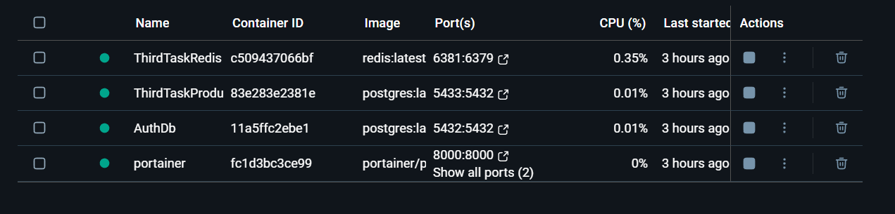
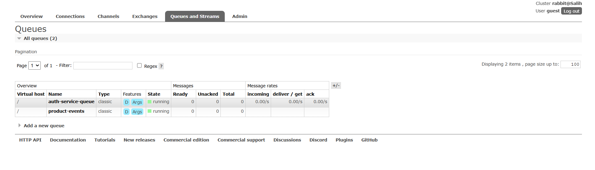
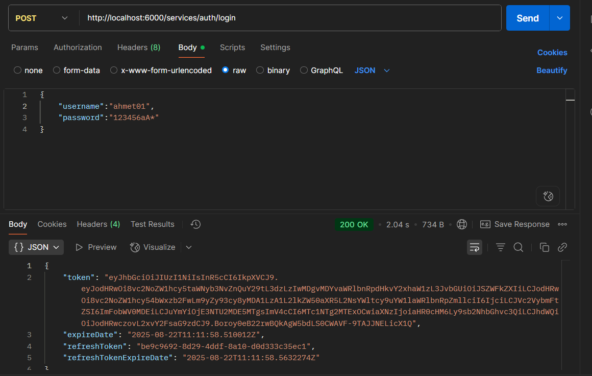
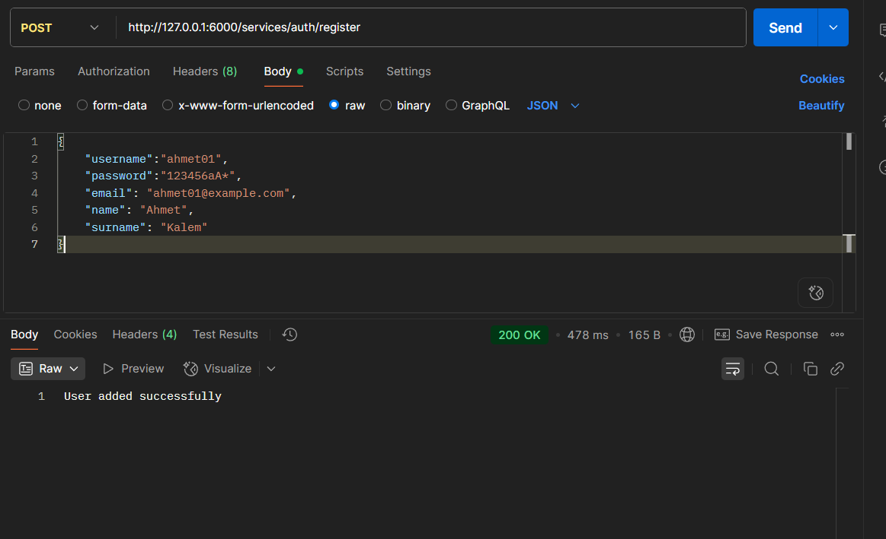
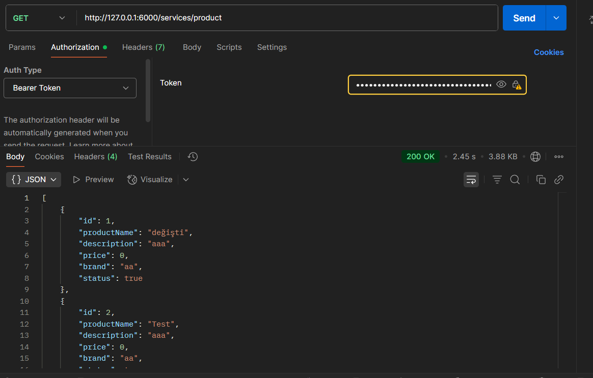
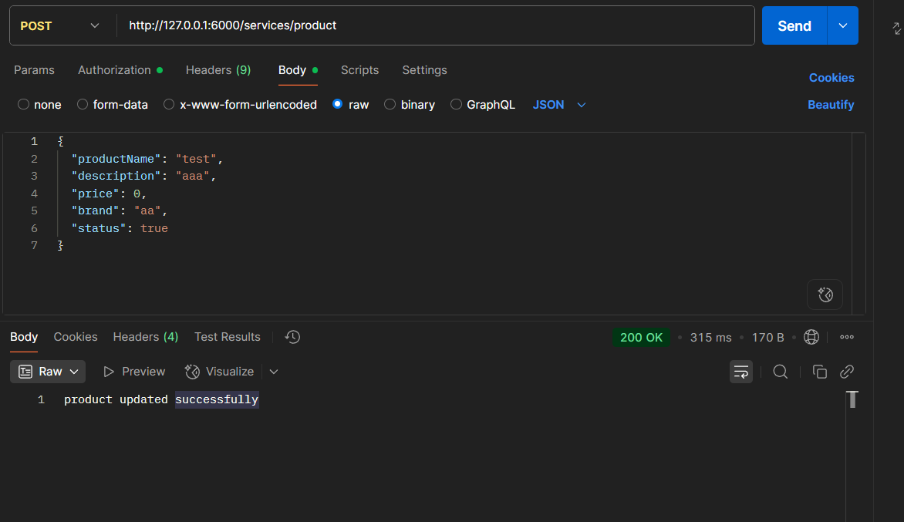
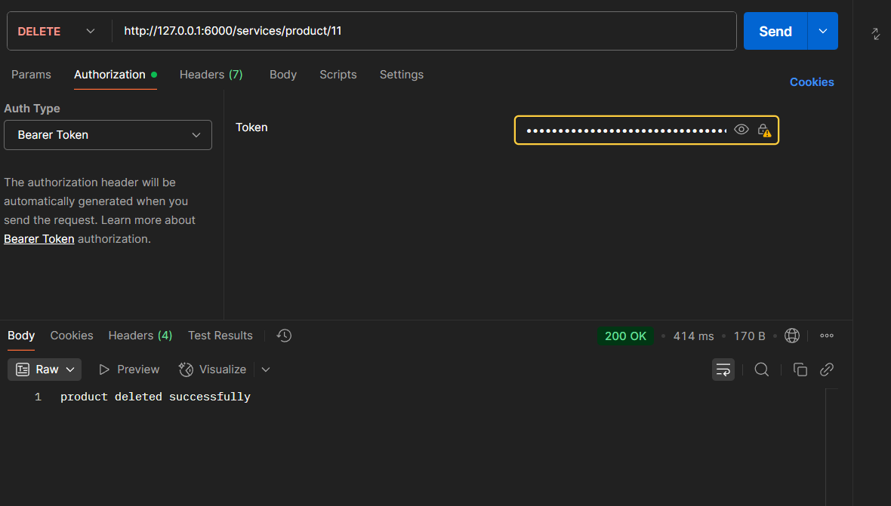
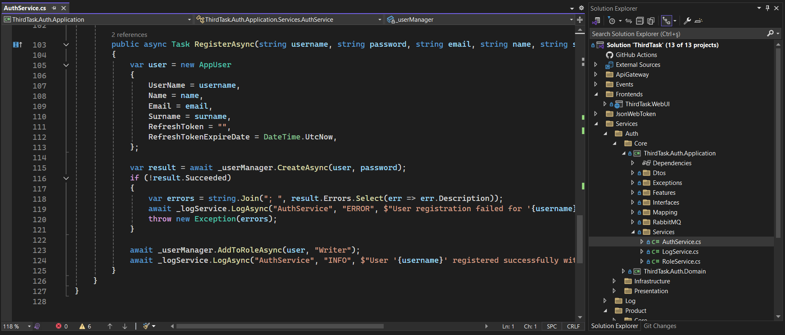

  <h2>Proje çalıştırmadan önce bilgisayarınızda yüklü olması gerekenler</h2>
  <ul>
    <li>Docker</li>
    <li>PostgreSql</li>
    <li>Visual Studio</li>
    <li>Dbeaver</li>
  </ul>
  <h3>Docker ve Dbeaver Ayarları</h3>
  

    CMD'yi yönetici olarak çalıştırıyoruz. <strong><i>docker volume create portainer_data</i></strong> bu komutu yapıştırıp enter'a basıyoruz. Daha sonra 
    <strong><i>docker run -d -p 8000:8000 -p 9000:9000 --name=portainer --restart=always -v /var/run/docker.sock:/var/run/docker.sock -v portainer_data:/data portainer/portainer-ce</i></strong> bu komutu yapıştırıp
    enter'a basıyoruz. Yükleme işlemi tamamlandıktan sonra tarayıcıya <strong><i>localhost:9000</i></strong> yazıyoruz ve enter'a basıyoruz. açılann portainer sekmesinde kayıt olarak giriş yapıyoruz.
    Home da bulunan local'e tıklıyoruz. Yan panelden templates tıklıyoruz ve arama çubuğuna Postgre yazıyoruz. Karşımıza gelen PostgreSQL'e tıkıyoruz. Açılan pencerede 
    <ul>
      <li>Name:AuthDb</li>
      <li>Superuser:postgres</li>
      <li>Superuser password:123456aA*</li>
    </ul>
    olarak yazıyoruz. Daha sonra show advanced options'a tıklayıp post numarasına 5432 yazıyoruz ve aşağıdan deploy ediyoruz. Bu işlemlerin aynısını tekrar yapıyoruz fakat bu kez Name:ThirdTaskProductDb
    ve port numarası 5433 olarak ayarlıyoruz. Son olarak templates arama çubuğuna redis yazıyoruz ve ilk çıkana tıklıyoruz. Name:ThirdTaskRedis ve port numarasını da 6381 olarak ayarlayıp deploy ediyoruz. 
    Fotoğraftaki gibi iseniz doğru yoldasınız.  Şimdi Visual Studio'ya dönelim. Burada package manager console'u açıyoruz ve Default Projects: kısmında ThirdTask.Auth.Persistence seçiyoruz. 
    <strong>add-migration mig_create</strong> yazıp enter'a basıyoruz. İşlem tamamladıktan sonra update-database diyoruz. Bunun aynısı tekrar yapıyoruz ancak bu sefer Default Projects: ThirdTask.Product.Persistence
    seçiyoruz. Bunları yaptıktan sonra Dbeaver'ı açıyoruz. Sol üstte File'ın altında fiş işaretine tıklıyoruz. Burada PostgreSQL seçiyoruz.
    <ul>
      <li>Host:localhost</li>
      <li>Post:5432</li>
      <li>Databases:ThirdTaskAuthDb</li>
      <li>Username:postgres</li>
      <li>Password:123456aA*</li>
    </ul>
    olarak ayarlıyoruz ve Finish diyoruz. Bunun aynısı tekrar yapıyoruz ancak bu sefer Databases:ThirdTaskProductDb ve Port:5433 olarak ayarlıyoruz. Artık Docker ve Dbeaver hazır durumda.
  

  <h3>Proje Tanıtımı</h3>
  

    ThirdTask projesi bir mikroservis projesidir. Projede temelde 4 adet mikroservis vardır. Bunlar:
      <ul>
        <li>Auth microservice</li>
        <li>Product microservice</li>
        <li>Log microservice</li>
        <li>OcelotGateway microservice</li>
      </ul>
      şeklindedir.
      

        <h4>Auth Microservice</h4>
        
Kullanıcılar için <strong>Login, Register ve RefreshToken</strong> metodlarını barındırır. Bu sayede Kullanıcı işlemleri bu mikroservis altında çalışmaktadır.

      

      

        <h4>Product Microservice</h4>
        
Ürünler için Temel CRUD işlemlerini yapar. Create işlemi sonrasında RabbitMQ üzerine bir mesaj gönderir ve diğer mikroservisler de bu mesaja subscribe olarak create işleminden haberdar olurlar.
         Ayrıca Redis Cache ile listeleme işlemleri, Cache Invalidation ve Rate Limiting ile CRUD işlemleri esnek ve sürdürülebilir hale getirilmiştir.

      

      

        <h4>Log Microservice</h4>
        
Auth ve Product mikroservisleri için log kayıtlarını json ve txt olarak 2 farklı dosyada tutar. Gelen Log kayıtları türüne göre <strong>(WARNING,INFO,ERROR...) sınıflandırılarak kaydedilir.</strong>

      

      

        <h4>Ocelot Gateway Mikroservice</h4>
        
Product, Auth ve Log mikroservislerini tek bir yönlendirme noktasında birleştirir ve hepsini aynı url farklı port numarasından ulaşabilmemize olanak tanır.

      

        

        Bunların dışında yardımcı mikroservisler de kullanılmıştır. Bunlardan biri ThirdTask.Jwt adında token üreten bir mikroservistir. Bir diğer proje ise Frontend tarafında olan UI projesidir.
        Microsoft Identity ile güvenlik güçlendirilmiştir.
  

  

    <h3>Kullanılan Teknolojiler</h3>
    <ul>
      <li>.Net 9.0</li>
      <li>Entity Framework</li>
      <li>PostgreSql</li>
      <li>Docker</li>
      <li>Dbeaver</li>
      <li>Postman</li>
      <li>RabbitMQ</li>
      <li>Json Web Token</li>
      <li>Microsoft Identity</li>
      <li>SeriLog</li>
      <li>Redis</li>
      <li>Ocelot Gateway</li>
      <li>Swagger</li>
      <li>CQRS</li>
      <li>Mediator</li>
      <li>Dto</li>
    </ul>
    <h3>Kullanılan Nuget Paketleri</h3>
    <ul>
      <li>Ocelot (24.0.1)</li>
      <li>Microsoft.AspNetCore.Authentication.JwtBearer (9.0.8)</li>
      <li>Newtonsoft.Json (13.0.3)</li>
      <li>System.IdentityModel.Tokens.Jwt (8.14.0)</li>
      <li>AutoMapper (15.0.1)</li>
      <li>MediatR (13.0.0)</li>
      <li>Microsoft.Extensions.Configuration.Abstractions (9.0.8)</li>
      <li>RabbitMQ.Client (7.1.2)</li>
      <li>Microsoft.AspNetCore.Identity (2.3.1)</li>
      <li>Microsoft.AspNetCore.Identity.EntityFrameworkCore (9.0.8)</li>
      <li>Microsoft.EntityFrameworkCore (9.0.8)</li>
      <li>Microsoft.EntityFrameworkCore.Design (9.0.8)</li>
      <li>Microsoft.EntityFrameworkCore.Tools (9.0.8)</li>
      <li>Npgsql (9.0.3)</li>
      <li>Npgsql.EntityFrameworkCore.PostgreSQL (9.0.4)</li>
      <li>Swashbuckle.AspNetCore (9.0.3)</li>
      <li>Serilog.AspNetCore (9.0.0)</li>
      <li>Serilog.Sinks.Console (6.0.0)</li>
      <li>Serilog.Sinks.File (7.0.0)</li>
      <li>Microsoft.AspNetCore.Http.Abstractions (2.3.0)</li>
      <li>Microsoft.Extensions.Hosting.Abstractions (8.0.1)</li>
      <li>StackExchange.Redis (2.8.58)</li>
      <li>Microsoft.Extensions.Caching.StackExchangeRedis (9.0.8)</li>
      <li>AspNetCoreRateLimit (5.0.0)</li>
    </ul>
  

  

  <h3>Projenin Çalışma Senaryosu (POSTMAN)</h3>
    Visual Studio da Solution(Sağ Tık) -> Configure Startup Projects -> Multiple Startup Projects:
    <ul>
      <li>ThirdTask.OcelotGateway</li>
      <li>ThirdTask.Auth.WebApi</li>
      <li>ThirdTask.Product.WebApi</li>
      <li>ThirdTask.WebUI</li>
      <li>ThirdTask.LogService</li>
    </ul>
    seçip Uygula ve Tamam diyoruz. Ardından Starta basıyoruz.
    

    Öncelikle kullanıcı kaydını yapıyoruz. 

 Kayıt olan kullanıcı ile login oluyoruz.
    

 Daha sonra ürünleri listeleme işlemi için Postmanda login yaptıktan sonra aldğımız token bilgisini Authentication menüsü altında
    Bearer seçip yapıştırıyoruz. 

 Ürünleri listelemek için Send butonuna tıklıyoruz.
    Ürün eklemek için gene token bilgisini verip POST işlemi için Send'e tıklıyoruz. 

 Eğer login yapan kullanıcının rol yetkisi
    Create için müsaitse ekleme işlemi yapılıyor. Değilse 403 döndürüyoruz. Aynı mantık ile Update ve Delete için de geçerli.
    

 Bu yapmış olduğumuz işlemler log dosyalarına arka planda kaydediliyor.
    Yetkilendirme kullanılmak istenirse resimdeki Writer yazan yer Reader olarak değiştirilebilir. 

  

 
  

